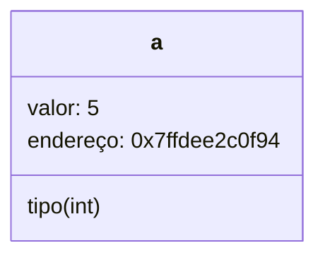
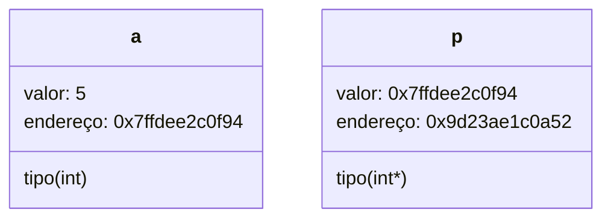

# Introdução a ponteiros

# Gustavo Lopes Rodrigues

## Você vai aprender

- O que é um ponteiro.
- Como utilizar ponteiros.

## Pré-requisitos

- Aulas passadas

## Trabalhando com endereços de memória

Nós já temos uma aula de ponteiros, que você pode dar uma olhada no nosso módulo da linguagem C, porém, está aula é mais para introduzir esse importante conceito que temos quando falamos de linguagens de programação de baixo nível, que é o ponteiro.

Você provavelmente deve se lembrar quando estavamos falando de linguagens de programação e eu expliquei em como linguagens de programação é uma forma de programar um programa de forma de alto nível, sem ter que falar a linguagem da máquina exata. 

Sim está definição não deixa de ser correta, mas é importante lembrar que por mais de a linguagem C seja de certa forma "alto nível" por não ter que forçar o usuário a usar o baixo nível da linguagem, de outras formas, a linguagem também C pode ser considerada de baixo nível, por permitir um maior controle da memória, por meio de ponteiros. Mas afinal de contas, o que é um ponteiro?

## O que é um ponteiro?



Quando criamos qualquer variável dentro da linguagem C, a variável, além de armazenar um valor, também possui um endereço que armazena esse valor em memória no seu computador, nós podemos imprimir esse valor utilizando o formato especial **%p** como no exemplo abaixo.

```c
#include<stdio.h>

int main(void) {
  int a = 5;
  printf("%p\n", &a);
```

Você provavelmente deve se lembrar de quando usamos o **scanf** precisavamos usar esse "&" para poder fazer a leitura do teclado, isso porque quando colocamos esse sinal acompanhado de uma variável estamos pedindo para extrair o endereço de memória dessa variável, criando um ponteiro.

Em outras palavras, um ponteiro é nada mais que uma variável que guarda o endereço de outra variável. E assim como uma variável qualquer podemos criar uma variável ponteiro utilizando o sinal \"\*\" acompanhado do tipo da variável, como no exemplo abaixo:

```c
#include<stdio.h>

int main(void) {
  int a = 5;
  int* p = &a;
  printf("%p\n", p);
```



Obs.: Importante notar que assim como a variável, o ponteiro também possui um endereço de memória, permitindo que seja assim criado uma cadeia infinita de ponteiros.

Ok, agora temos um ponteiro, mas o que a final de contas podemos fazer com ele? Uma propriedade muito interessante que podemos fazer com isso é que a partir desse ponteiro,, podemos mudar o valor de "a" sem mexer com a variável "a", vamos ver como fazer isso.

## Desreferenciando memória

Como dito anteriormente, quando trabalhamos com ponteiros, nós temos o endereço de memória de uma variável. Nós podemos acessar o valor desse endereço de memória utilizando o \"\*\", essa ação faz com que a gente desreferencie o ponteiro, e acesse o valor que está guardado no endereço.

```c
#include<stdio.h>

int main(void) {
  int a = 5;
  int* p = &a;
  printf("%d %d\n", *p, a);
```

Utilizando esse conhecimento nós podemos usar essa mesma sintaxe, para mudar o valor de "a" fazendo uma atribuição ao conteúdo do endereço armazenado em "p" que no nosso caso é o valor de "a".

```c
#include<stdio.h>

int main(void) {
  int a = 5;
  int* p = &a;
  *p = 7;
  printf("%d %d\n", *p, a);
```

Isso nos permite fazer diferentes tipos de operação que antes não era possível, como por exemplo, retornar mais de um valor em uma função.

### Retornando dois valores de uma função

Tecnicamente falando, você sabe que não existe como retornar dois valores de uma função, porém, a partir de ponteiros, podemos replicar esse comportamento. Pense no seguinte caso de uso, queremos criar um programa que seja capaz de trocar o conteúdo de duas variáveis, dentro da função main isso é tranquilo e o exemplo abaixo ilustra isso.

```c
#include<stdio.h>

int main(void) {
  int a = 5;
  int c = 3;
  int tmp = a;
  a = c;
  c = tmp;
  printf("a = %d, c = %d\n", a,c);
  return 0;
}
``` 

Apenas utilizando uma variável temporária nós conseguimos fazer a troca entre dois elementos, mas e se agora, o objetivo é exportar esse comportamento para uma função, ou seja, criar uma função que faça essa troca para gente. A primeira vista, esse problema não tem solução, pois não é possível retornar dois valores, porém usando ponteiros, isso é possível.

```c
#include<stdio.h>

void trocar(int* a, int* c){
  int tmp = *a;
  *a = *c;
  *c = tmp;
}

int main(void) {
  int a = 5;
  int c = 3;
  
  trocar(&a,&c);
  
  printf("a = %d, c = %d\n", a,c);
  return 0;
}
```

Note que passamos para a função ```trocar``` o endereço de "a" e "c" permitindo que dentro de outra função, seja possível trocar os valores de variáveis que estão dentro de outro escopo.

Obs.: Esse processo de passar um valor para outra função usando ponteiros se chama: passar um valor por referência.

## Conclusão

É claro que isso é o mais básico de ponteiros, mas espero que dessa forma vocês tenham entendido o básico em como trabalhar com essa poderosa ferramenta da linguagem C. Caso tenham-se interessado no assunto não se esqueçam de dar uma olhada no nosso material sobre ponteiros no módulo de C.

## Links úteis

- [Ponteiros e Alocação de memória - C](https://github.com/Programando-o-Mundo/Microfundamentos-AEDs/blob/main/C/ponteiro/Ponteiro-e-aloca%C3%A7%C3%A3o-de-mem%C3%B3ria.md)
