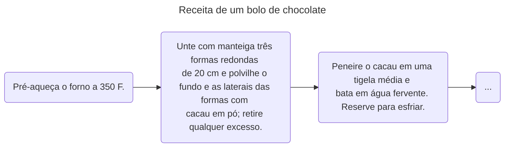
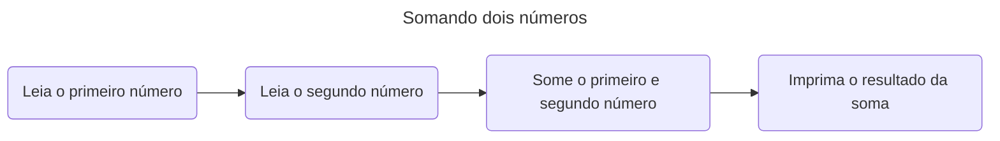
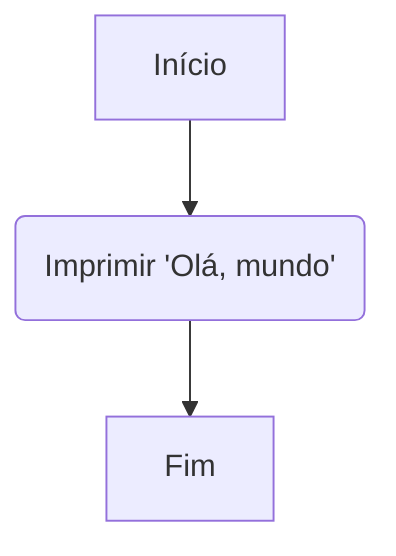

# Sejam bem vindos a Algoritmos e Estruturas de Dados I

Aqui é onde tudo começa, neste módulo, você irá dar seus primeiros passos para entender como podemos combinar Algoritmos e as Estruturas de Dados
para resolver os mais diversificados problemas que o mundo da Computação já viu. Essa é uma clássica disciplina de resolução de problemas,
e para resolver tais problemas, primeiro é preciso conhecer as ferramentas que temos em nossa disposição e as noções básicas de como utilizar as mesmas.

## Mundo tecnológico

Atualmente, vivemos em um mundo que está se tornando cada vez mais adepto a tecnologia, onde a partir dela, realizamos grande parte das atividades do nosso dia-a-dia. 
Neste contexto, existe três importantes palavras que circulam no mundo da tecnologia e que são importantes de uma forma ou outra para a disciplina que estamos trabalhando. 

A primeira palavra é **Hardware** que são os componentes físicos que fazem os nossos celulares e computadores funcionarem. Alguns nomes aqui são familiares, como por exemplo: CPU, GPU, RAM, Placa mãe, e entre vários outros. 

O segundo termo é: **Software**, que são os programas construídos para rodar "em cima" do hardware dos nossos aparelhos. Existe uma gama absurda de Softwares no mundo atual, que realizam tarefas completamente diferentes, desde o Whatsapp para mandar mensagens, até o Google Maps para geolocalização.

Por fim, por trás de todo software, nós temos **Algoritmos**, mas como podemos definir eles?

## Algoritmos

Na ciência da computação, um algoritmo é uma sequência de etapas que define um conjunto de instruções de maneira precisa para resolver um determinado problema ou executar uma tarefa específica. Parece meio complicado, mas vamos tentar enxergar isso a partir de outras palavras. Imagine uma receita para uma comida, um bolo por exemplo. Agora, quando vamos cozinhar qualquer coisa, precisamos de uma receita, para que dessa forma conseguimos seguir um passo-a-passo, certo? Pois então, agora lembre-se desse passo-a-passo, já que este é um processo muito similar que algoritmos realizam para resolver problemas, onde uma tarefa é divida em pequenas tarefas.





Com o exemplo acima, acredito que correlação entre o ato de cozinhar e programar deve ter ficado mais clara de visualizar. Mas agora fica a pergunta: como que fornecemos essas instruções para as máquinas? Bem, essas instruções pode ser fornecidas ao computador com o auxílio das chamadas "linguagens de programação", poderosas ferramentas computacionais padronizadas, que são formadas dos seus próprios conjuntos de regras sintáticas e semânticas, permitindo desenvolvedores colocarem algoritmos para funcionarem na prática. Pense que assim como eu estou utilizando da lingua portuguesa para explicar este tópico para vocês, nós desenvolvedores usamos das linguagens de programação para "explicar" para a máquina como a nossa aplicação será executada.

Mantenha em mente que, quando falamos de um algoritmo qualquer, podemos falar tanto da ideia abstrata, quanto da implementação prática da mesma. Isso acontece porquê podemos implementar ou ilustrar o mesmo algoritmo de diferentes formas e usando diferentes linguagens de programação.

Eis por exemplo, um algoritmo implementando em algo chamado "pseudocódigo":

```
Inicio

EscreverNaTela("Olá mundo")

Fim
```

Outra forma, é utilizando fluxogramas, onde cada passo do fluxograma é um passo da execução:



Por fim, podemos implementar na prática, usando uma linguagem de programação. Não é necessário entender como o código abaixo funciona, mas apenas saiba que o mesmo é escrito em C:

```c
#include<stdio.h>

int main() {
    printf("Olá, mundo");
    return 0;
}
```

## Características dos algoritmos

Com o conceito compreendido, vamos falar sobre alguma das características iniciais que devemos saber sobre Algoritmos. Entenda que para esta parte inicial, não se preocupe em entender os códigos de exemplo, apenas os conceitos.

### Finitude: 

Um algoritmo precisa ter um fim, ou seja, ele deve terminar após um número finito de passos. Isso implica que o algoritmo tem um número definido de etapas que levarão à conclusão de uma tarefa ou solução de um problema. Por exemplo, se temos um algoritmo para encontrar o maior número em uma lista, ele continuará comparando os números até que todos sejam verificados e, por fim, fornecerá o maior número presente na lista.

### Definição: 

Cada etapa do algoritmo deve ser clara e bem definida, sem margem para ambiguidades ou interpretações duplas. Isso significa que as instruções devem ser precisas o suficiente para que qualquer pessoa que siga o algoritmo possa entender e executar as ações necessárias. Por exemplo, um algoritmo para ordenar uma lista de números deve indicar claramente os passos a serem seguidos, como comparar elementos, trocar posições, etc.

```plaintext
Início
ListaNumeros = [5, 2, 9, 1, 8]

Para i de 0 até tamanho(ListaNumeros) - 1 Faça
    Para j de i+1 até tamanho(ListaNumeros) Faça
        Se ListaNumeros[i] > ListaNumeros[j] Então
            Trocar(ListaNumeros[i], ListaNumeros[j])
        Fim Se
    Fim Para
Fim Para

Escrever("Lista ordenada:", ListaNumeros)
Fim
```

Neste exemplo, o pseudocódigo ilustra a definição ao ordenar uma lista de números sem ambiguidades, seguindo instruções precisas e definidas.

### Entradas: 

Um algoritmo pode ter zero ou mais entradas, que são as informações necessárias para executar o algoritmo. Essas entradas são os dados iniciais com os quais o algoritmo trabalha. Por exemplo, em um algoritmo de adição de dois números, as entradas seriam os próprios números a serem somados.
```plaintext
Início
Número1 = Ler("Digite o primeiro número: ")
Número2 = Ler("Digite o segundo número: ")

Soma = Número1 + Número2

Escrever("A soma dos números é", Soma)
Fim
```
Esse pseudocódigo exemplifica um algoritmo que recebe dois números como entrada e calcula a soma.

### Saídas: 

Assim como as entradas, um algoritmo deve produzir uma ou mais saídas, que são os resultados ou soluções derivados das operações realizadas pelo algoritmo com as entradas fornecidas. Por exemplo, um algoritmo para multiplicar dois números fornecerá a resposta, que é o produto desses números.
```plaintext
Início
Número1 = 5
Número2 = 8

Produto = Número1 * Número2

Escrever("O produto dos números é", Produto)
Fim
```
Neste exemplo, o pseudocódigo calcula o produto de dois números e fornece a saída, que é o valor do produto.

### Efetividade: 

Por fim, cada passo do algoritmo deve ser composto por operações básicas e claras, que podem ser executadas de forma precisa em um tempo finito por qualquer pessoa. Isso significa que as instruções do algoritmo devem ser realizáveis e não deixar margem para interpretações subjetivas. 

Existe mais detalhes que deveriam ser levados em conta quanto a produção de algoritmos, mas por agora, acredito que essas informações seja o suficiente. O que devemos realmente focar no momento é como começar a construir os nossos primeiros algoritmos, e para isso nós temos que aprender a usar uma linguagem de programação. 

Antes disso, para que possamos criar os nossos algoritmos, precisamos de um segundo importante componente, que seriam as Estruturas de Dados.

## Estruturas de Dados

Vamos voltar brevemente ao nosso exemplo sobre o ato de cozinhar. A essa altura, você então deve saber que, para cozinhar, precisamos do nosso passo-a-passo, ou o nosso "algoritmo". Porém, você deve ter percebido que uma coisa foi omitida desse exemplo, e essa coisa seria os nossos ingredientes. No contexto da programação, nossos ingredientes seriam as chamadas Estruturas de dados.

Estruturas de dados são formas de representar itens de dados logicamente relacionados as informações que queremos retratar na resolução do nosso problema. Novamente, vamos tentar ilustrar este contexto, para que o mesmo fique mais claro: Suponhamos que estamos trabalhando em uma padaria, e que estamos no caixa. Neste cenário, imagine que você esteja contabilizando o valor total da compra de um cliente qualquer. Para isso você precisa reservar um número, mais precisamente, números que guardem as casas decimais. Essa representação numérica você provavelmente conhece como "números reais", já na computação temos duas representações, uma sendo os numeros de ponto flutuante ou apenas "float" e os "double". Observe como que a forma como representamos os dados do nosso problema precisa ser escolhida com cuidado, pois se escolhermos um número inteiro por exemplo, parte dos dados da compra poderiam ser perdidos e logo, nosso algoritmo não representa fielmente os dados que queremos armazenar.

Além disso, é desejável que a estrutura de dado, também seja eficiente, ou seja, não use recursos a mais do que precisa, por exemplo, estamos programando o interruptor de uma lâmpada, sabemos aqui que temos dois estados: ligado (ON) e desligado (OFF), para isso temos uma estrutura de dado chamado boolean (ou simplesmente bool) que representa um dígito (0 ou 1) onde 0 representa falso "False" e pode ser a nossa lâmpada desligada, e 1 representa verdadeiro "True" e pode ser a nossa lâmpada ligada. Veja que neste exemplo, tanto um número real, quanto um número inteiro poderiam resolver o nosso problema, porém estariamos usando um canhão para matar uma formiga, já que precisamos apenas de dois números.

Quando estamos escrevendo o nosso algoritmo, nós declaramos essas estruturas da mesma forma que escrevemos números ou palavras em um pedaço de papel, e junto aos conjuntos de instruções fornecido pelas linguagens de programação, nós conseguimos dar luz aos programas que conseguem tornar as nossas vidas diárias mais simples e confortáveis.

# Por enquanto é so...

É claro que tem muito mais a ser explorado na disciplina, como por exemplo, você sabia que existem dois tipos de estruturas de dados? As chamadas estruturas de dados primitivas e não primitivas? Quais são as suas diferenças, bem, acredito que por enquanto seja o suficiente, e em aulas futuras iremos voltar para este tópico. Com os conhecimentos aqui vocês tiveram uma pequena amostra no quê a disciplina irá trabalhar. Recomendo fortemente também dar uma olhada para o material complementar dessa aula, pois contém outras fontes de recursos na qual você pode aprender a disciplina.

Muito obrigado e até a próxima! 

## Links úteis

- [Aula completa de AEDs1 - UNIVERSIDADE FERNANDO PESSOA](http://www3.dsi.uminho.pt/iiee/repos/AEDados.pdf)
- [CS50 - Uma das melhores aulas introdutórias de Computação do Mundo!](https://youtu.be/8mAITcNt710)
- [Curso de Lógica de programação da "Metrópole Digital](https://materialpublic.imd.ufrn.br/curso/disciplina/3/13)
