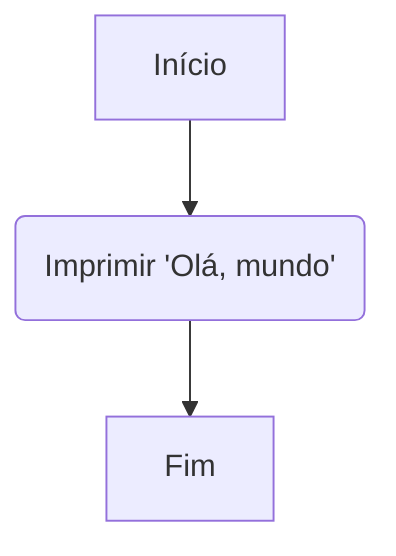

# Sejam bem vindos a Algoritmos e Estruturas de Dados I

Aqui é onde tudo começa, neste módulo, você irá desde o começo para entender como podemos combinar Algoritmos e Estruturas de Dados
para resolver os mais diversificados problemas que o mundo da Computação já viu. Essa é uma clássica disciplina de resolução de problemas,
e para resolver tais problemas, primeiro é preciso conhecer as ferramentas que temos em nossa disposição.

Começaremos do mais simples, que no nosso caso é os algoritmos.

## O que é um Algoritmo?

A cada vez mais que os dias se passam, o mundo vai se tornando cada vez mais adepto a tecnologia, até que a mesma faça parte do nosso dia-a-dia. 
Existe três importantes palavras que circulam no mundo da tecnologia e as três são importantes de uma forma ou outra para essa a disciplina em questão. A primeira é hardware que é o meio físico na qual usamos a tecnologia, como é o caso dos celulares e os computadores por exemplo. O segundo termo é o software, que são aplicações construídas para rodar "em cima" do hardware e cumprem nossas tarefas do dia-a-dia (ex: Whatsapp, Google Maps, Google Chrome, entre outros). Por fim, nós temos os algoritmos, mas o que são eles?

Na ciência da computação, um algoritmo é uma sequência de etapas que define um conjunto de instruções de maneira precisa para resolver um determinado problema ou executar uma tarefa específica. Esse conjunto bem definido de instruções pode ser implementado a partir de uma "linguagem de programação", uma poderosa ferramenta computacional padronizada, formada do seu próprio conjuntos de regras sintáticas e semânticas que permitem desenvolvedores colocarem algoritmos para funcionarem na prática. Pense que assim como eu estou utilizando da lingua portuguesa para explicar este tópico para vocês, nós desenvolvedores usamos das linguagens de programação para "explicar" para a máquina como a nossa aplicação será executada.

Mantenha em mente que, quando falamos de Algoritmo nós estamos falando mais do abstrato, da ideia do passo-a-passo que possa resolver um problema específico. Principalmente porquê podemos implementar o mesmo algoritmo de diferentes formas, ilustrar as ideias contidas no algoritmo de forma diferente e usando diferentes linguagens de programação. Por outro lado, o Software é a ideia concreta, ou seja, é o algoritmo (ou até um conjunto de algoritmos) implementado de forma unificada, com o objetivo de realizar uma determinada tarefa.

Existem muitos tipos de algoritmos e eles podem ser usados para uma ampla variedade de propósitos. Alguns algoritmos são projetados para resolver tipos específicos de problemas, como classificar uma lista de números ou encontrar o caminho mais curto entre dois pontos. Outros são de uso mais geral e podem ser usados para resolver uma ampla variedade de problemas.

## Características dos algoritmos

Com o conceito compreendido, vamos falar sobre alguma das características iniciais que devemos saber sobre Algoritmos. Entenda que para esta parte inicial, não se preocupe em entender os códigos de exemplo, apenas os conceitos.

### Finitude: 

Um algoritmo precisa ter um fim, ou seja, ele deve terminar após um número finito de passos. Isso implica que o algoritmo tem um número definido de etapas que levarão à conclusão de uma tarefa ou solução de um problema. Por exemplo, se temos um algoritmo para encontrar o maior número em uma lista, ele continuará comparando os números até que todos sejam verificados e, por fim, fornecerá o maior número presente.

```plaintext
Início
Contador = 0

Enquanto Contador < 10 Faça
    Escrever("Iteração ", Contador)
    Contador = Contador + 1
Fim Enquanto

Escrever("Algoritmo concluído.")
Fim
```
Este pseudocódigo ilustra a finitude ao realizar uma contagem até 10, encerrando após um número finito de passos.

### Definição: 

Cada etapa do algoritmo deve ser clara e bem definida, sem margem para ambiguidades ou interpretações duplas. Isso significa que as instruções devem ser precisas o suficiente para que qualquer pessoa que siga o algoritmo possa entender e executar as ações necessárias. Por exemplo, um algoritmo para ordenar uma lista de números deve indicar claramente os passos a serem seguidos, como comparar elementos, trocar posições, etc.

```plaintext
Início
ListaNumeros = [5, 2, 9, 1, 8]

Para i de 0 até tamanho(ListaNumeros) - 1 Faça
    Para j de i+1 até tamanho(ListaNumeros) Faça
        Se ListaNumeros[i] > ListaNumeros[j] Então
            Trocar(ListaNumeros[i], ListaNumeros[j])
        Fim Se
    Fim Para
Fim Para

Escrever("Lista ordenada:", ListaNumeros)
Fim
```

Neste exemplo, o pseudocódigo ilustra a definição ao ordenar uma lista de números sem ambiguidades, seguindo instruções precisas e definidas.

### Entradas: 

Um algoritmo pode ter zero ou mais entradas, que são as informações necessárias para executar o algoritmo. Essas entradas são os dados iniciais com os quais o algoritmo trabalha. Por exemplo, em um algoritmo de adição de dois números, as entradas seriam os próprios números a serem somados.
```plaintext
Início
Número1 = Ler("Digite o primeiro número: ")
Número2 = Ler("Digite o segundo número: ")

Soma = Número1 + Número2

Escrever("A soma dos números é", Soma)
Fim
```
Esse pseudocódigo exemplifica um algoritmo que recebe dois números como entrada e calcula a soma.

### Saídas: 

Assim como as entradas, um algoritmo deve produzir uma ou mais saídas, que são os resultados ou soluções derivados das operações realizadas pelo algoritmo com as entradas fornecidas. Por exemplo, um algoritmo para multiplicar dois números fornecerá a resposta, que é o produto desses números.
```plaintext
Início
Número1 = 5
Número2 = 8

Produto = Número1 * Número2

Escrever("O produto dos números é", Produto)
Fim
```
Neste exemplo, o pseudocódigo calcula o produto de dois números e fornece a saída, que é o valor do produto.

### Efetividade: 

Por fim, cada passo do algoritmo deve ser composto por operações básicas e claras, que podem ser executadas de forma precisa em um tempo finito por qualquer pessoa. Isso significa que as instruções do algoritmo devem ser realizáveis e não deixar margem para interpretações subjetivas. Por exemplo, um algoritmo para calcular a média de uma lista de números deve incluir instruções específicas, como adicionar todos os números e dividir pelo total de elementos, em vez de usar termos vagos como "some os números de sua preferência"."
```plaintext
Início
ListaNumeros = [4, 7, 2, 9, 5]
Soma = 0

Para cada número na ListaNumeros Faça
    Soma = Soma + número
Fim Para

Média = Soma / tamanho(ListaNumeros)

Escrever("A média dos números é", Média)
Fim
```
Este pseudocódigo ilustra a efetividade ao calcular a média de uma lista de números com instruções claras e precisas, sem margem para interpretações subjetivas.

### Implementação

Como dito anteriormente, os algoritmos são representações abstratas de como podemos resolver um problema computacional, já que podemos implementar o mesmo algoritmo de formas diferentes e em diferentes linguagens/representações. Alguns exemplos, inclui, representar o código usando "pseudocódigo" como os exemplos anteriores:

```
Inicio

Escrever("Olá mundo")

Fim
```

Outra forma, é utilizando fluxogramas, onde cada passo do fluxograma é um passo da execução:



Por fim, podemos implementar na prática, usando uma linguagem de programação. Não é necessário entender como o código abaixo funciona, mas apenas saiba que o mesmo é escrito em C:

```c
#include<stdio.h>

int main() {
    printf("Olá, mundo");
    return 0;
}
```

Sobre a parte técnica dos algoritmos acredito que por agora seja o suficiente. Existe mais detalhes que deveriam ser levados em conta quanto a produção de algoritmos, mas por agora, acredito que seja o suficiente. O que devemos realmente focar no momento é como começar a construir os nossos primeiros algoritmos, e para isso nós temos que aprender a usar uma linguagem de programação. Antes disso, para que possamos criar os nossos algoritmos, precisamos de um segundo importante componente, que seriam as Estruturas de Dados.

## Estruturas de Dados

Estruturas de dados são formas de representar itens de dados logicamente relacionados ao dados que queremos representar. Isso parece muito confuso, mas pense o seguinte: Suponhamos que estamos trabalhando em uma padaria, e que estamos trabalhando no caixa. Neste cenário, imagine que você esteja contabilizando o valor total da compra do cliente, para isso você precisa de um número, mais precisamente, números com casas decimais. Essa representação numérica pertence a um grupo matemático chamado de "números reais" e na computação chamamos essa representação de números de ponto flutuante ou apenas "float". Observe como que a forma como representamos os dados do nosso problema precisa ser escolhida com cuidado, pois se escolhermos um número inteiro por exemplo, parte dos dados da compra poderiam ser perdidos e logo, nosso algoritmo não representa fielmente os dados que queremos armazenar.

Além disso, é desejável que a estrutura de dado, também seja eficiente, ou seja, não use recursos a mais do que precisa, por exemplo, estamos programando o interruptor de uma lâmpada, sabemos aqui que temos dois estados: ligado (ON) e desligado (OFF), para isso temos uma estrutura de dado chamado boolean (ou simplesmente bool) que representa um dígito (0 ou 1) onde 0 representa falso "False" e pode ser a nossa lâmpada desligada, e 1 representa verdadeiro "True" e pode ser a nossa lâmpada ligada. Veja que neste exemplo, tanto um número real, quanto um número inteiro poderiam resolver o nosso problema, porém estariamos usando um canhão para matar uma formiga, já que precisamos apenas de dois números.

Quando estamos escrevendo o nosso algoritmo, nós declaramos essas estruturas da mesma forma que escrevemos números ou palavras em um pedaço de papel, e junto aos conjuntos de instruções fornecido pelas linguagens de programação, nós conseguimos dar luz aos programas que conseguem tornar as nossas vidas diárias mais simples e confortáveis.

# Por enquanto é so...

É claro que tem muito mais a ser explorado na disciplina, como por exemplo, você sabia que existem dois tipos de estruturas de dados? As chamadas estruturas de dados primitivas e não primitivas? Quais são as suas diferenças, bem, acredito que por enquanto seja o suficiente, e em aulas futuras iremos voltar para este tópico. Com os conhecimentos aqui vocês tiveram uma pequena amostra no quê a disciplina irá trabalhar. Recomendo fortemente também dar uma olhada para o material complementar dessa aula, pois contém outras fontes de recursos na qual você pode aprender a disciplina.

Muito obrigado e até a próxima! 

## Links úteis

- [Aula completa de AEDs1 - UNIVERSIDADE FERNANDO PESSOA](http://www3.dsi.uminho.pt/iiee/repos/AEDados.pdf)
- [CS50 - Uma das melhores aulas introdutórias de Computação do Mundo!](https://youtu.be/8mAITcNt710)
- [Curso de Lógica de programação da "Metrópole Digital](https://materialpublic.imd.ufrn.br/curso/disciplina/3/13)
