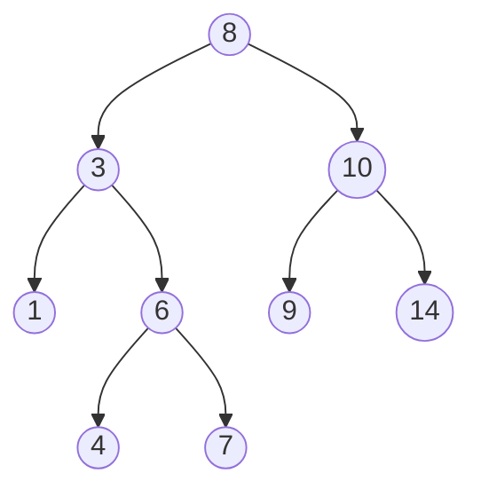

# Árvore Binária

Com certeza, uma das mais importantes estruturas de dados na Ciência da Computação são as árvores. Neste caso temos a árvore binária, que é uma estrutura de dados que consiste em nós organizados em uma estrutura semelhante a uma árvore. Cada nó em uma árvore binária tem no máximo dois filhos, que são chamados de filho esquerdo e filho direito.

Abaixo temos o exemplo de uma árvore binária, perceba que o conteúdo dos nós da esquerda são menores do que o conteúdo dos nós da direita.

Existem muitas maneiras diferentes de usar árvores binárias, mas um uso comum é armazenar e organizar dados de forma a permitir inserção, exclusão e pesquisa rápidas, pois a maneira na qual os nós são armazenados (com o menor a esquerda e o maior a direita) permite que a complexidade das operações seja O(log(n)).&#x20;

Para adicionar um novo elemento a uma árvore binária, você normalmente começaria na raiz e compararia o valor do novo elemento com o valor na raiz. Se o novo valor for menor que o valor na raiz, você deve seguir o filho esquerdo até o próximo nó na árvore; se o novo valor for maior, você seguirá o filho certo. Você continuaria esse processo até chegar a um nó folha (um nó sem filhos), no ponto em que inseriria o novo valor como filho do nó folha.

Para procurar um valor em uma árvore binária, você seguiria um processo semelhante, começando na raiz e comparando o valor que está procurando com o valor em cada nó. Se o valor que você está procurando for menor que o valor no nó atual, você deve seguir o filho esquerdo; se for maior, você seguirá a criança certa. Você continuaria esse processo até encontrar o valor que está procurando ou chegar a um nó folha, momento em que saberia que o valor não está na árvore.
